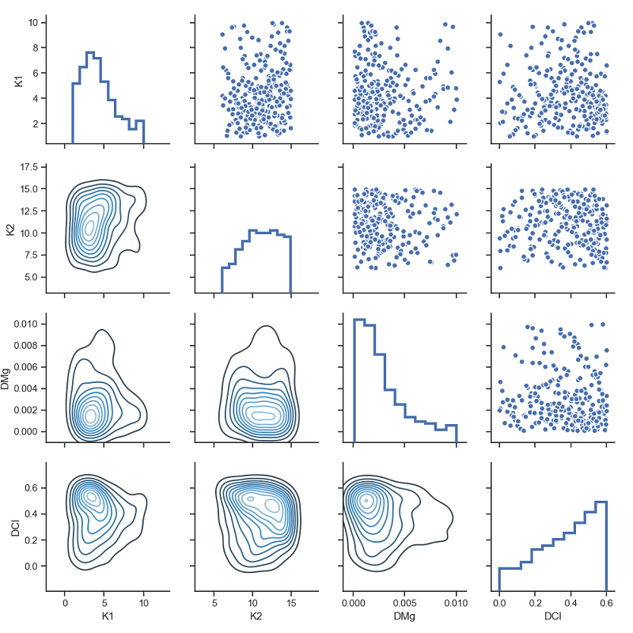
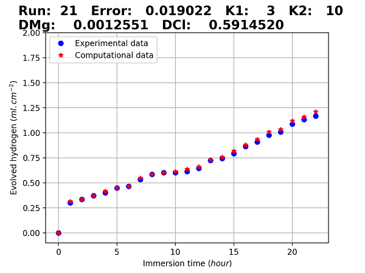

# Bayesian Optimization for Finite Element Parameter Estimation

This repository contains an efficient (and small) code for estimating the value of parameters of mathematical models, which is usually an indispensable aspect of scientific computing and computational engineering projects. This code tries to fit the output of a computational model (such as a finite element simulation) to the provided reference data.

The code uses Bayesian optimization algorithm by taking advantage of [Hyperopt](https://github.com/hyperopt/hyperopt), a powerful distributed optimization package, and a Root-Mean-Square Error objective function. This approach is suitable for computational intensive codes (when each simulation takes one hour or more to run). Gradient-based approaches loose their efficiency in this situation because they require evaluating objective function multiple times to calculate the gradient (which is indeed running the simulation code multiple times in each optimization step). Take notice that in most of computational models, the Jacobian cannot be calculated directly, and as a result, the simulation code is a black box from the optimization perspective.

A basic postprocessor is also developed using [seaborn](https://seaborn.pydata.org/) and [pandas](https://pandas.pydata.org/) to visualize and process the output of the optimization code (figures below).

## Source files

The code should be slightly modified to match the configuration of each project, but the modification is straightforward and simple due to provided comments in the source files.

Here is a general description of the code structure:

* *optim.py*: The main file to configure parameters and optimization algorithm. This also contains the objective function and the error calculation procedures.
* *process.py*: Helper functions to call the main simulation (usually an external binary or code) and extract desired data from the generated output.
* *result.py*: A simple postprocessor to visualize the output of the optimization process, both graphically and in CSV file format. Some sample output files are provided to test this functionality.
* *data.csv*: The reference data points, usually obtained from experiments. The number of points in this file should match the number of points generated by the simulation code.

## How to use

This code is developed in Python 3.7 and depends on a couple of packages to work. The common first step in this sort of scenarios is creating a python virtual environment and activating it. This can be done in a wide range of methods using `venv`, `conda`, and `pipenv`. A simple approach with proper description for different platforms can be found [here](https://docs.python.org/3/tutorial/venv.html).

After activating the virtual environment, you should install required packages:

`$ pip install -r requirements.txt`

Then you can start optimization process by running

`$ python optim.py`

After that, you can run the postprocessor:

`$ python result.py`

You may run the postprocessor out of the box on sample output files to see the result. The generated figures are stored in *figs* directory.
